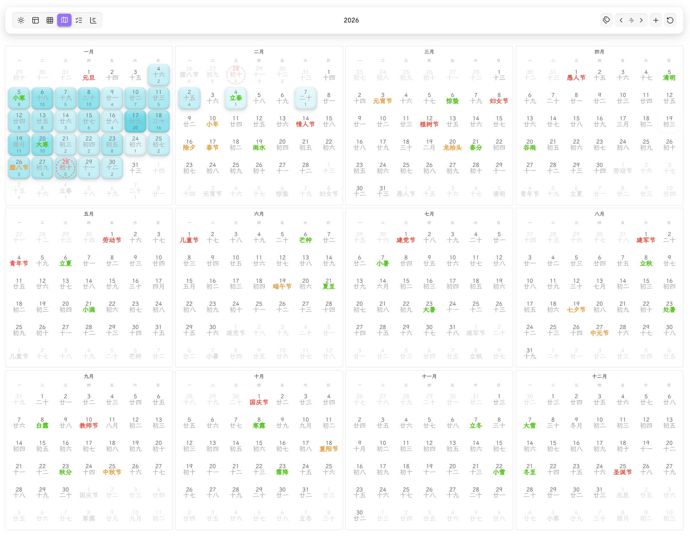

# Obsidian Gantt Calendar

<div align="center" style="padding: 20px; border: 2px solid #8b5cf6; border-radius: 12px; background: linear-gradient(135deg, rgba(139, 92, 246, 0.05) 0%, rgba(59, 130, 246, 0.05) 100%); margin: 20px 0;">

✨ 一个强大的 Obsidian 任务管理和日历插件 ✨

🗓️ **多视图日历** - 任务视图/日历视图(年月周日)/甘特图三大视图自由切换，

🏮 **节日显示** - 支持公历/农历节日和二十四节气显示

📊 **数据可视化** - 任务热力图、每日任务数量统计、8种渐变配色方案

✅ **智能任务管理** - 全局筛选、优先级标记、6种时间属性、实时缓存更新

📝 **Daily Note 集成** - 日视图支持显示当天笔记，水平/垂直布局可选

🎨 **高度可定制** - 节日颜色、热力图配色、任务显示数量等全面配置

🔗 **双格式兼容** - 完美支持 Tasks 插件（emoji）与 Dataview 插件（字段）格式

</div>

---
## Screenshots

YearView


---

Gantt View


## 🚀 Quick Start

### 安装插件

#### 使用`BRAT`插件安装:
1. 下载并启用社区插件 `BRAT`
2. 执行命令 `Add a beta plugin for testing (with or without version)`
3. 填写仓库地址: https://github.com/sustcsugar/obsidian-gantt-calendar


#### 手动安装
1. 下载最新的 [Release](https://github.com/sustcsugar/obsidian-gantt-calendar/releases)
2. 解压后将文件夹复制到 `<你的库>/.obsidian/plugins/`
3. 重启 Obsidian 并在设置中启用插件

### 打开视图

**点击侧边栏按钮**
- 通过侧边栏按钮打开插件的视图页面.

**视图切换**
- 在工具栏左侧点击**视图切换按钮**快速切换

### 工具栏添加任务
- 工具栏右侧功能区,使用**添加任务**按钮, 创建任务.

### 手动创建任务
> 通过quickadd/tasks插件,进行任务的创建

在任何 Markdown 文件中输入：
```markdown
- [ ] 🎯 完成项目文档 📅 2025-12-20
```

刷新插件即可在日历和任务列表中看到该任务！


## 📋 主要功能

### 界面布局

插件采用顶部工具栏 + 内容区的布局结构：

**工具栏（Toolbar）** - 分为左/中/右三个区域：
- **左侧**：视图切换(六大视图切换)
- **中间**：当前日期(范围)/标题显示
- **右侧**：功能按钮

---

### 任务格式

**Tasks 插件格式（Emoji）**
```markdown
- [ ] 🎯 完成项目文档 ⏫ ➕ 2025-01-10 📅 2025-01-15
```

| Emoji | 含义 | Emoji | 含义 |
|-------|------|-------|------|
| `🎯` | 全局标记 | `🔺` | 最高优先级 |
| `⏫` | 高优先级 | `🔼` | 中优先级 |
| `🔽` | 低优先级 | `⏬` | 最低优先级 |
| `➕` | 创建日期 | `🛫` | 开始日期 |
| `⏳` | 计划日期 | `📅` | 截止日期 |
| `✅` | 完成日期 | `❌` | 取消日期 |

**Dataview 插件格式（字段）**
```markdown
- [ ] 🎯 完成项目文档 [priority:: high] [created:: 2025-01-10] [due:: 2025-01-15]
```

| 字段 | 含义 | 字段 | 含义 |
|------|------|------|------|
| `priority::` | 优先级 | `created::` | 创建日期 |
| `start::` | 开始日期 | `scheduled::` | 计划日期 |
| `due::` | 截止日期 | `completion::` | 完成日期 |
| `cancelled::` | 取消日期 | - | - |

**任务属性说明**
1. **全局筛选标记**：必须在复选框后开头位置，用于筛选特定任务
2. **任务描述**：纯文本内容，属性标记会自动清理
3. **优先级**：6 个等级（highest/high/medium/normal/low/lowest）
4. **时间属性**：6 种可选日期（格式 `YYYY-MM-DD`）

---


### 年视图
- **全年概览**：12 个月卡片展示全年任务分布
- **任务热力图**：5 级颜色梯度，直观显示任务密度
  - 8 种配色方案：蓝/绿/红/紫/橙/青/粉/黄
- **任务数量统计**：可选显示每日任务总数
- **农历显示**：月卡片内显示农历日期
- **点击交互**：点击日期切换到日视图

### 月视图
- **月度日历**：标准月历布局，清晰显示每日任务
- **任务列表**：每天显示指定数量的任务（可配置 1-10 个）
- **任务弹窗**：点击日期显示当天完整任务列表
- **节日显示**：阳历节日、农历节日、节气三色标记
- **周起始配置**：支持周一/周日开始

### 周视图
- **周计划视图**：横向展示一周 7 天
- **每日任务列表**：显示每天的所有任务
- **今日高亮**：当天日期特殊标记
- **灵活导航**：上一周/本周/下一周快速切换

### 日视图
- **详细任务列表**：显示当天所有任务详情
- **Daily Note 集成**：
  - 支持显示当天笔记内容
  - 水平布局（左右分屏）：任务在左，笔记在右
  - 垂直布局（上下分屏）：任务在上，笔记在下
- **农历信息栏**：显示农历日期、节日、节气
- **任务跳转**：点击任务直接定位到源文件

### 甘特视图
- 可交互的甘特任务条
  - 支持拖动整体任务条
  - 支持拖动左右端点拖动
  - 点击任务条跳转到任务对应的文件

---

## 📅 开发计划

### 任务解析

- ✅ 支持 Tasks 和 Dataview 双格式任务解析
- ✅ 完整的任务属性支持
    - ✅ 任务全局筛选符号
    - ✅ 任务标签属性(在tasks格式上扩展的字段)
    - [ ] 嵌套标签识别
    - ✅ 任务描述
    - ✅ 任务6种优先级
    - ✅ 任务6种时间属性(颗粒度为日期)
    - ✅ 重复任务识别
    - [ ] 重复任务显示
- [ ] 换行任务识别
- [ ] 子任务识别
- [ ] 任务依赖关系
- [ ] 任务时间字段扩展(细化颗粒度到小时)


### 视图规划
- ✅ 日视图Daily Note 集成（支持水平/垂直布局）
- ✅ 周视图卡片拖动
- ✅ 月视图卡片拖动
- ✅ 年视图任务热力图和数量统计
- ✅ 年视图日历显示
- ✅ 任务视图
- ✅ 甘特图
    - ✅ 甘特条拖动
    - ✅ 

### 工具栏功能
- ✅ 工具栏视图切换功能
- ✅ 工具栏右侧功能区按钮重构
    - ✅ 标签筛选
    - ✅ 任务状态筛选
    - ✅ 优先级排序
    - ✅ 日期导航按钮(日历视图)
    - ✅ 时间字段筛选(任务视图)
    - ✅ 添加任务按钮

### 交互功能
- ✅ 任务卡片
    - ✅ 任务描述
    - ✅ 任务标签
    - ✅ 任务优先级
- ✅ 任务右键菜单
    - ✅ 编辑任务
    - ✅ 创建任务笔记
    - ✅ 任务延期
    - ✅ 任务优先级修改
- ✅ 任务悬浮窗功能


### 💡 未来计划（v2.0.0）
- [ ] 订阅第三方日历
    - [ ] 飞书日历
    - [ ] outlook日历
- [ ] 第三方任务同步
    - [ ] 飞书任务
    - [ ] Microsoft To Do


### 贡献指南
欢迎提交 Issue 和 Pull Request！


## 📄 许可证

MIT License - 详见 [LICENSE](LICENSE) 文件

---

<div align="center">

💡 **遇到问题或有建议？** 欢迎提交 [Issue](https://github.com/sustcsugar/obsidian-gantt-calendar/issues)

⭐ **喜欢这个插件？** 请给我们一个 Star！

</div>
